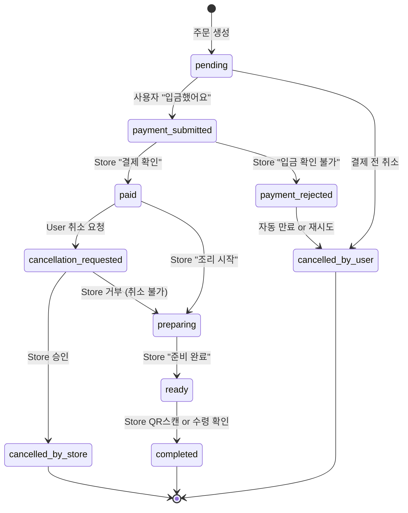

# HAN:GO — 한동대학교 주문·결제·예매 플랫폼 PRD

- **문서 버전**: v0.3 (CRA 프로젝트 명시, §13 결정사항 반영)
- **작성일**: 2026-04-21
- **상태**: 재검토 요청
- **운영 주체**: **CRA (Computer-Research-Association)** @ Handong University
- **v0.2 대비 주요 변화**: CRA 프로젝트로 포지셔닝, 비회원 주문(전화번호) 지원, 서버 검증 QR 채택, GTM 단계 전환 전략 로드맵 반영

---

## 1. 개요

### 1.1 제품 개요

HAN:GO는 한동대학교 학내 커뮤니티(부스·동아리·학생 단체)가 **음식 판매, 공연 예매, 이벤트 티켓팅**을 수행할 수 있도록 하는 **상시 운영형 주문·결제 플랫폼**이다. 축제 기간 외에도 공연 동아리 공연, 학생 단체 굿즈 판매, 소규모 이벤트 등에 재사용 가능하도록 설계한다.

### 1.2 운영 모델 — 상시 운영

- **Store**: 동아리·부스 등 영속적 운영 주체 (상시 존재)
- **Product**: 판매 대상. 상시형(예: 굿즈)과 이벤트 귀속형(예: 공연 회차, 축제 메뉴) 모두 지원
- **Event** (선택적): 특정 기간에 묶이는 제품 컬렉션 (예: "2026 가을 축제"). 탐색 UI 및 기간 한정 상품 그룹핑에 사용

### 1.3 프로젝트 포지셔닝 — CRA 프로젝트

HAN:GO는 **한동대 동아리 CRA (Computer-Research-Association)** 가 개발·운영하는 학생 주도 프로젝트이다. 학교 행정과의 공식 협업 없이도 독립적으로 운영 가능하도록 설계되며, 다음을 포함한다:

- 앱 푸터·About 페이지에 **"Built by CRA @ Handong University"** 명시
- 기존 `Computer-Research-Association` GitHub Organization 하위에 레포 생성
- 각 스토어는 본인 계좌/카카오페이로 결제를 수령하므로, HAN:GO는 결제 중개가 아닌 **주문·예매 및 결제 안내** 플랫폼임을 이용약관에 명시
- 결제·환불·세무 관련 책임은 각 스토어 귀속

### 1.4 비전

> "축제 한 번이 앱 하나로 끝나도록 — 주문부터 공연까지, HAN:GO."

- **단기 (2026년 여름~가을)**: 파일럿 공연 동아리 대상 공연 예매 + 간단 음식 주문 MVP
- **중기 (2026 가을 축제)**: 축제 부스 확대 적용
- **장기**: 학내 상시 커머스·티켓팅 인프라

---

## 2. 목표 및 성공 지표

### 2.1 목표

1. 학내 소규모 운영 주체가 **별도 인프라 없이 온라인 주문·결제·예매**를 제공할 수 있게 한다.
2. `Product.type` 기반 polymorphic 설계로 **음식/공연/굿즈를 단일 플랫폼**에서 운영한다.
3. 공식 협업 없이도 운영 가능한 **저마찰 결제·온보딩** 흐름을 제공한다.

### 2.2 성공 지표 (KPI)

| 단계     | 지표                                            | 목표치     |
| -------- | ----------------------------------------------- | ---------- |
| 파일럿   | 온보딩된 동아리 수                              | 3개 이상   |
| 파일럿   | 공연 1회차 판매 성공률 (예매 → 결제확인 → 입장) | 90% 이상   |
| MVP      | 축제 기간 총 주문 건수                          | 500건 이상 |
| MVP      | 결제 완료율 (주문 생성 대비)                    | 85% 이상   |
| MVP      | 스토어 운영자 1인당 앱 학습 시간                | 10분 이내  |
| 상시운영 | 월간 활성 스토어 수                             | 5개 이상   |
| 운영     | 주요 기능 무장애 운영 비율                      | 99% 이상   |

---

## 3. 범위

### 3.1 In-Scope (Phase 1, MVP)

- 관리자(Admin) 대시보드 — 스토어 계정 발급·권한 관리
- 스토어(Store) 대시보드 — 상품 등록, 재고·옵션 관리, 좌석 레이아웃 편집기, 주문 접수·처리, 결제 확인
- 일반 사용자(User) — **카카오 로그인 + 비회원 주문(전화번호)**, 상품 탐색, 주문 생성, 결제 진행, 취소 요청
- 외부 간편송금 링크 기반 결제 플로우 + 수동 결제 확인 (B-1)
- 주문 상태 추적 및 조리 전 취소 플로우
- **서버 검증 기반 QR** 픽업·입장 확인 (L-2)
- 실시간 주문 알림 (폴링 + WebSocket)

### 3.2 Out-of-Scope (Phase 2+)

- 정산 자동화 및 세무 리포트
- 환불 자동화 (초기에는 수기 처리)
- PWA 푸시 알림
- 네이티브 앱 (iOS/Android)
- 오픈뱅킹/카카오페이 비즈니스 API 연동
- 굿즈(MERCH) 상세 기능 — 기본 등록만 지원

---

## 4. 사용자 및 역할

### 4.1 Admin (시스템 관리자)

- CRA 운영팀 — 플랫폼 전반 관리
- 로그인: 별도 내부 계정 (이메일 + 비밀번호 + 2FA 권장)
- 스토어 계정 발급·비활성화, 전체 모니터링, 분쟁 중재

### 4.2 Store Owner (부스/동아리 운영자)

- 동아리·부스 단위 계정
- 로그인: 이메일 + 비밀번호
- 스토어 프로필, 상품·재고·옵션·좌석 관리, 주문 처리, 취소 승인, QR 스캔

### 4.3 User (일반 사용자) — 하이브리드 인증 (K-2 확정)

- **카카오 로그인 사용자 (Member)**: 주 타겟. 주문 이력 관리, 빠른 재주문, 프로필 기반 개인화
- **비회원 사용자 (Guest)**: 전화번호만 입력. 주문 조회는 `전화번호 + 주문번호`로 접근
- 두 경로 모두 동일한 주문·결제 플로우를 사용하되, Guest는 주문 이력 페이지 대신 **주문번호 기반 조회 링크**를 제공받음

---

## 5. 주요 기능 요구사항

### 5.1 Admin 기능

| ID   | 기능                           | 설명                                                        |
| ---- | ------------------------------ | ----------------------------------------------------------- |
| A-01 | 스토어 계정 발급               | 초대 링크 또는 임시 비밀번호 방식. 발급 시 운영자 정보 기록 |
| A-02 | 스토어 권한·상태 관리          | 활성/정지/삭제, 카테고리 제한                               |
| A-03 | 전체 모니터링                  | 스토어·상품·주문 필터·검색 대시보드                         |
| A-04 | 공지 게시                      | 플랫폼 전체 배너·공지                                       |
| A-05 | 이벤트(Event) 관리             | 그룹 단위 생성 및 상품 연결                                 |
| A-06 | 분쟁·취소 수동 중재            | 스토어·사용자 간 취소/환불 분쟁 발생 시                     |
| A-07 | **스토어 신청 심사** (Phase 2) | I-2 전환 후 셀프 신청 동아리 심사 및 승인                   |

### 5.2 Store Owner 기능

| ID   | 기능                  | 설명                                                             |
| ---- | --------------------- | ---------------------------------------------------------------- |
| S-01 | 스토어 정보 관리      | 이름, 위치, 운영 시간, 대표 이미지, 소개                         |
| S-02 | 결제 수단 등록        | 카카오페이 송금 URL 또는 계좌번호. 주문 시 사용자에게 노출       |
| S-03 | 상품 등록·관리        | 타입(FOOD/PERFORMANCE/MERCH) 선택 후 타입별 필드 입력            |
| S-04 | 재고 관리 (듀얼 모드) | `unlimited` / `tracked` / `manual_sold_out`                      |
| S-05 | 좌석 레이아웃 편집기  | Grid 기반 (행·열, 셀 상태: AVAILABLE / UNAVAILABLE / VIP)        |
| S-06 | 주문 접수·상태 전환   | 실시간 알림, 상태 버튼                                           |
| S-07 | 결제 확인 (B-1)       | 입금자명 = 주문번호 매칭 후 `paid` 전환                          |
| S-08 | 취소 요청 승인/거부   | 조리 시작 전 요청에 대해 처리                                    |
| S-09 | **QR 스캐너** (L-2)   | 모바일 웹 카메라로 QR 스캔 → 서버 검증 API 호출 → 결과 즉시 표시 |
| S-10 | 매출 요약             | 일자/상품별 판매 건수 및 금액                                    |

### 5.3 User 기능

| ID   | 기능                    | 설명                                                                       |
| ---- | ----------------------- | -------------------------------------------------------------------------- |
| U-01 | **인증 (하이브리드)**   | 카카오 로그인 또는 비회원(전화번호 입력 + OTP 또는 단순 입력 — §13-K 참조) |
| U-02 | 이벤트·스토어·상품 탐색 | 카테고리, 이벤트 필터, 검색                                                |
| U-03 | 상품 상세               | 타입별 옵션 UI (공연은 좌석 맵)                                            |
| U-04 | 장바구니 (스토어당 1개) | 다른 스토어 담을 시 초기화 확인 모달                                       |
| U-05 | 주문 생성               | 옵션·좌석 확정 → 결제 단계                                                 |
| U-06 | 결제 진행               | 송금 URL/계좌번호 노출, 입금자명 = 주문번호 안내                           |
| U-07 | 주문 내역·상태 확인     | Member: 마이페이지 / Guest: `주문번호 + 전화번호` 조회 링크                |
| U-08 | 취소 요청               | 조리·공연 시작 전 요청 가능                                                |
| U-09 | 수령/입장               | QR 코드 노출 (스토어 스캔용)                                               |

### 5.4 비회원(Guest) 주문 플로우 (K-2 확정)

```
[사용자]                             [HAN:GO]
  │                                      │
  │── "비회원으로 주문하기" 클릭 ──────→│
  │                                      │
  │←── 전화번호 입력 페이지 ─────────────│
  │                                      │
  │── 전화번호 입력 (+ OTP) ────────────→│  ※ OTP 도입 여부는 §13-K-sub 참조
  │                                      │
  │←── Guest 세션 발급 ──────────────────│
  │     (카카오 로그인과 동일한 주문 UI)  │
  │                                      │
  │── 주문 생성 ~ 결제 ─────────────────→│
  │                                      │
  │←── 주문 확인 + 조회 링크 ────────────│
  │     URL 예: /order?code=HG-A3F7&tel=XXXX
  │                                      │
  │── 조회 링크 재접속 ─────────────────→│
  │← 주문번호 + 전화번호 매칭 시 상태 조회
```

> Guest는 로그아웃 개념 대신 **세션 쿠키 TTL (24시간)** 만료로 처리. 주문번호와 전화번호만 기억하면 재조회 가능.

### 5.5 결제 플로우 — B-1 상세

```
[User]                       [HAN:GO]                     [Store Owner]
  │                              │                               │
  │── 장바구니 확정·주문 요청 ─→│                               │
  │                              │─ ORDER_ID 생성 (예: HG-A3F7) │
  │                              │─ 상태: pending                │
  │←── 결제 안내 페이지 ─────────│                               │
  │     (송금URL/계좌번호,                                       │
  │      입금자명=ORDER_ID 명시)                                 │
  │                                                              │
  │── 외부 앱에서 송금 ───────→ (카카오페이/은행)              │
  │         입금자명: HG-A3F7                                    │
  │                                                              │
  │── "입금했어요" 버튼 클릭 ──→│                               │
  │                              │── 실시간 알림 ──────────────→│
  │                              │                               │
  │                              │       ┌─ 스토어가 송금 알림 ─┤
  │                              │       │   또는 통장 확인       │
  │                              │       │   → 주문번호 매칭      │
  │                              │       │                         │
  │                              │←─── "결제 확인" 클릭 ────────┤
  │                              │─ 상태: paid                   │
  │                              │  (PERFORMANCE면 Ticket 발급)  │
  │←── 결제 확인 알림 ───────────│                               │
```

### 5.6 QR 입장/수령 플로우 — L-2 서버 검증 (확정)

```
[Store Owner 단말]                     [HAN:GO Server]              [User 단말]
         │                                    │                            │
         │                                    │←── QR 코드 노출 ───────────│
         │                                    │    (Ticket.qr_token)        │
         │                                    │                            │
         │── 카메라로 QR 스캔 ────────────────│                            │
         │── POST /tickets/verify ───────────→│                            │
         │    { qr_token: "..." }             │                            │
         │                                    │                            │
         │                                    │─ 검증 로직:                │
         │                                    │   1) 토큰 유효성             │
         │                                    │   2) 상태 == "issued"       │
         │                                    │   3) 공연 시간 범위 내      │
         │                                    │   4) 해당 스토어 소유       │
         │                                    │                            │
         │                                    │─ 원자적 업데이트:           │
         │                                    │   UPDATE tickets            │
         │                                    │   SET status='used',        │
         │                                    │       used_at=NOW()         │
         │                                    │   WHERE id=? AND            │
         │                                    │     status='issued'         │
         │                                    │                            │
         │←── 200 OK / 409 Conflict ──────────│                            │
         │    (conflict = 이미 사용 or 잘못)  │                            │
         │                                    │                            │
         │─ 화면에 결과 표시 (OK/중복/오류)   │                            │
```

**보안·위조 방지 포인트**:

- `qr_token`은 DB에만 존재하는 랜덤 문자열 (예: nanoid, 22자)
- 서버에서 원자적 상태 전이 — 동일 토큰 재스캔 시 409
- 공연 시간 ±N시간 윈도우 외 스캔 거부 (설정 가능)
- 해당 QR이 스캔자 스토어 소유가 아니면 거부 (권한 검증)

### 5.7 주문 상태 머신



**PERFORMANCE 타입**은 `preparing` 단계 없이 `paid → issued(티켓 발급) → used(QR 스캔으로 입장)` 로 단순화.

### 5.8 취소·환불 정책

- 조리/공연 시작 전까지 사용자 취소 요청 가능
- 스토어 승인 필수
- 환불은 수기 처리 (스토어 → 사용자 직접 송금)
- 이용약관에 환불 책임 주체가 각 스토어임을 명시

---

## 6. 제품(Product) 타입별 요구사항

### 6.1 FOOD

- 옵션: 맵기, 토핑, 사이드 등
- 재고: `tracked` 또는 `manual_sold_out` 권장
- 픽업: 대기 번호 기반 현장 수령
- 상태: `pending → paid → preparing → ready → completed`

### 6.2 PERFORMANCE (공연) — MVP 포함

- 옵션: 회차, 좌석 (지정석)
- 좌석 레이아웃: 스토어가 grid 기반 편집기로 직접 설정
  - 셀 상태: `AVAILABLE` / `UNAVAILABLE` / `VIP`
  - 판매된 셀은 자동 `SOLD`
- 재고: 좌석 수 = capacity, `tracked` 고정
- 티켓: `paid` 즉시 생성, `qr_token` 부여
- 입장: 서버 검증 QR 스캔 (L-2)
- 상태: `pending → paid → issued → used`

### 6.3 MERCH — 기본 등록만 MVP 범위

- 상품 등록은 가능하지만 픽업/배송 상세 플로우는 Phase 2

### 6.4 옵션 스키마 (JSON 기반)

```json
{
  "product_id": "booth_42_ramen",
  "type": "FOOD",
  "stock_mode": "tracked",
  "stock": 100,
  "option_schema": [
    {
      "key": "spicy",
      "label": "맵기",
      "type": "select",
      "values": ["순한맛", "보통", "매운맛"],
      "required": true
    },
    {
      "key": "egg",
      "label": "계란 추가",
      "type": "boolean",
      "price_delta": 500
    }
  ]
}
```

```json
{
  "product_id": "club_99_winter_concert",
  "type": "PERFORMANCE",
  "schedules": [
    { "id": "r1", "datetime": "2026-12-15T19:00+09:00", "venue": "효암채플" }
  ],
  "seat_layout": {
    "rows": 8,
    "cols": 12,
    "cells": [
      {
        "row": 0,
        "col": 0,
        "label": "A1",
        "status": "AVAILABLE",
        "tier": "GENERAL"
      },
      { "row": 0, "col": 6, "status": "UNAVAILABLE" }
    ],
    "tier_prices": { "GENERAL": 10000, "VIP": 15000 }
  }
}
```

---

## 7. 비기능 요구사항

### 7.1 성능

- 동시 접속 500명 기준 주문 API p95 < 1초
- 피크 시간 분당 50건 이상 처리
- 좌석 선점 경합 방지 (행 락 또는 낙관적 락 + 5분 홀드 TTL)

### 7.2 보안

- 카카오 OAuth 2.0 state 파라미터 검증
- 비회원 전화번호는 해시 저장 또는 최소 보관, 조회 시 전체 번호 뒤 4자리 매칭 방식 고려
- 스토어·관리자 비밀번호 bcrypt 해시, 관리자 2FA 권장
- QR `qr_token`은 예측 불가 랜덤 (nanoid 22자 이상), DB 검증만으로 유효성 판단
- 결제 관련 민감 정보(카드번호·계좌 비번) 절대 저장·처리 않음
- 관리자·스토어 주요 작업 감사 로그

### 7.3 가용성 및 운영

- 클라우드 기반 배포 (Vercel / Fly.io or Railway / Neon or Supabase 조합 권장)
- 99%+ 가용성 목표
- 외부 서비스(카카오 로그인, 송금 URL) 장애 시 안내

### 7.4 UX·접근성

- 모바일 우선 디자인
- PWA 대응 (홈 화면 추가)
- 한국어 기본, 영어 토글
- WCAG AA 기본 준수

### 7.5 법적·규정 준수

- 푸터·About 페이지에 CRA 프로젝트 명시
- 개인정보처리방침 (카카오 로그인 및 비회원 전화번호 수집 항목 명시)
- 결제/환불/세무 책임은 각 스토어 귀속

---

## 8. 데이터 모델 (v0.3 업데이트)

```
User
  id, auth_type[KAKAO|GUEST], kakao_id?, nickname?, profile_image?,
  phone?, email?, created_at, last_login_at
  ※ auth_type=KAKAO: kakao_id 필수 / auth_type=GUEST: phone 필수

Store
  id, name, slug, location, opening_hours, description,
  payment_methods (jsonb: [{type:"kakaopay_url", value:...},
                           {type:"bank_account", bank, number, holder}]),
  status, created_at

StoreAccount
  id, store_id, email, password_hash, role, created_at

AdminAccount
  id, email, password_hash, two_factor_enabled, created_at

Event
  id, name, starts_at, ends_at, cover_image, description

Product
  id, store_id, event_id?, type[FOOD|PERFORMANCE|MERCH],
  name, description, base_price, status,
  stock_mode[unlimited|tracked|manual_sold_out], stock,
  option_schema (jsonb), created_at

PerformanceSchedule   # Product.type=PERFORMANCE
  id, product_id, datetime, venue, seat_layout (jsonb)

Order
  id, order_code (예: HG-A3F7), user_id, store_id,
  total_price, status, guest_phone?,  # Guest 주문 빠른 조회용 (User.phone 동기)
  created_at, paid_at?, cancelled_at?, completed_at?

OrderItem
  id, order_id, product_id, schedule_id?, seat_keys (jsonb)?,
  quantity, selected_options (jsonb), unit_price, subtotal

Payment
  id, order_id, method[KAKAOPAY_URL|BANK_TRANSFER|OTHER],
  amount, status[pending|submitted|confirmed|rejected],
  confirmed_by (store_account_id), confirmed_at

Ticket   # PERFORMANCE 전용
  id, order_item_id, qr_token (UNIQUE, 랜덤 22자+),
  status[issued|used|revoked], issued_at, used_at?, scanned_by?

CancellationRequest
  id, order_id, requested_by, reason, status[requested|approved|rejected],
  resolved_by, resolved_at

AuditLog
  id, actor_type, actor_id, action, target_type, target_id, payload (jsonb), created_at
```

**Guest 주문 조회 쿼리**:

```sql
SELECT * FROM orders
WHERE order_code = $1
  AND guest_phone = $2
  AND user_id IN (SELECT id FROM users WHERE auth_type='GUEST');
```

---

## 9. 기술 스택

### 9.1 확정 스택 후보

| 레이어             | 선택                                                       | 근거                                |
| ------------------ | ---------------------------------------------------------- | ----------------------------------- |
| Frontend           | **Next.js 14+ (App Router) + Tailwind + shadcn/ui**        | 모바일 웹·PWA 대응, AI agent 친화적 |
| Backend            | **FastAPI (Python)**                                       | 친숙도, Pydantic 스키마 활용        |
| DB                 | **PostgreSQL**                                             | 트랜잭션, JSONB, 좌석 락            |
| Realtime           | **WebSocket (FastAPI)**                                    | 주문 상태 push                      |
| Auth (User)        | **카카오 OAuth 2.0 + 자체 Guest 세션**                     | K-2 하이브리드                      |
| Auth (Store/Admin) | **자체 JWT**                                               | —                                   |
| QR                 | **nanoid 토큰 + 서버 검증 엔드포인트**                     | L-2 확정                            |
| Storage            | **S3 호환** (Cloudflare R2 or Supabase Storage)            | 상품 이미지                         |
| Deploy             | **Vercel (FE) + Fly.io/Railway (BE) + Neon/Supabase (DB)** | 클라우드 네이티브                   |
| CI/CD              | **GitHub Actions** (CRA Organization 하위)                 | 기존 경험 활용                      |
| Monitoring         | **Sentry + 헬스체크**                                      | MVP 수준                            |

### 9.2 AI Agent 개발 환경 고려사항

- 레포 루트에 `CLAUDE.md` / `AGENTS.md` 작성
- Pydantic 스키마 ↔ TypeScript 타입 OpenAPI 자동 생성
- 주요 플로우 E2E 테스트 (Playwright)
- 수수료 정책 미확정(§13-J) — **결제 금액 계산 로직을 서버 단일 진입점(`calculate_order_total`)으로 추상화**하여 향후 수수료 추가 시 수정 범위 최소화

---

## 10. 로드맵 (v0.2 유지, GTM 전환 시점 명시)

| 단계                   | 기간  | 핵심 산출물                                                               | GTM 모드                                         |
| ---------------------- | ----- | ------------------------------------------------------------------------- | ------------------------------------------------ |
| **P0: 설계**           | 1–2주 | PRD v1.0 확정, 데이터 모델·API 스펙, 인프라 셋업, 디자인 시스템           | —                                                |
| **P1a: 공통 기반**     | 2주   | 카카오 로그인 + 비회원 주문, 계정, 스토어·상품 CRUD, 이벤트               | —                                                |
| **P1b: 주문·결제**     | 2주   | 주문, B-1 결제 플로우, 상태 머신, WebSocket 알림                          | —                                                |
| **P1c: 타입별 (병렬)** | 3주   | FOOD(옵션·재고) / PERFORMANCE(좌석 편집기·서버검증 QR)                    | —                                                |
| **P1d: 파일럿**        | 2주   | 공연 동아리 1–2팀 실전 파일럿                                             | **I-1 (초청 기반)**                              |
| **P1.5: 피드백 반영**  | 2주   | UX/버그 수정                                                              | I-1                                              |
| **P2: 축제 확장**      | 2–3주 | 2026 가을 축제 온보딩, 모니터링 강화                                      | **I-1 → I-2 전환** (셀프 신청 오픈, 운영팀 승인) |
| **P3+: 상시 운영**     | 이후  | 굿즈 상세, 정산 리포트, PWA 푸시, 분석 대시보드, 수수료 정책 (§13-J) 결정 | I-2                                              |

**총 MVP 기간**: 약 10–12주.

---

## 11. 확정된 결정 사항

| 항목                   | 확정 내용                                                                                            |
| ---------------------- | ---------------------------------------------------------------------------------------------------- |
| A. 사용자 인증         | 카카오 로그인 **+ 비회원(전화번호) 주문** (K-2 반영)                                                 |
| B. 결제 확인 방식      | B-1: 입금자명=주문번호 + 스토어 수동 확인                                                            |
| C. 알림 수단           | 폴링 + WebSocket; Phase 2에서 PWA 푸시                                                               |
| D. 공연 좌석 정책      | 지정석, 판매자가 grid 레이아웃 직접 설정                                                             |
| E. 취소 정책           | 조리 시작 전 취소 가능, 운영자 승인 필요, 환불 수기                                                  |
| F. 장바구니 범위       | 스토어당 1개 주문                                                                                    |
| G. 재고 관리           | `tracked` + `manual_sold_out` 듀얼 모드                                                              |
| H. 운영 기간           | 상시 운영                                                                                            |
| I. GTM 전략            | **P1d–P2 초기는 I-1 초청 기반, P2 후반부터 I-2 셀프 신청 + 승인**                                    |
| J. 수수료 정책         | **미확정** — J-1(무료) 또는 J-2(건당 수수료) 중 장기 결정. 아키텍처는 양쪽 모두 수용 가능하도록 설계 |
| K. 카카오 외 대체 경로 | **K-2: 카카오 + 비회원 주문(전화번호)**                                                              |
| L. 티켓 QR             | **L-2: 서버 검증 + 원자적 1회 스캔 처리**                                                            |
| M. 파일럿 일정         | 미정, 로드맵 상세 미변경                                                                             |

---

## 12. §12 질문 응답 반영 결과

| 질문                   | 답변                     | PRD 반영                                                   |
| ---------------------- | ------------------------ | ---------------------------------------------------------- |
| 축제운영주체 공식 협업 | 불가                     | §1.3 **CRA 프로젝트로 포지셔닝** (비공식 서비스 표현 제거) |
| 재무팀 협의            | 불가                     | B-3/B-4 스코프 아웃, 각 스토어 개인/동아리 계좌 사용       |
| 서버 인프라            | 클라우드                 | §9.1 클라우드 네이티브 구성                                |
| 팀 구성                | AI agent 활용            | §10 로드맵 확장, §9.2 AI agent 개발 가이드                 |
| 파일럿                 | 공연 동아리 대상, 미확정 | §10 P1d 유지, 확정 시 P1c 우선순위 조정 가능               |

---

## 13. 잔여 결정 사항 및 후속 논의

### J-후속. 수수료 정책 (장기 결정)

- P3+ 진입 전 결정 필요
- 아키텍처상 `calculate_order_total()` 단일 지점에서 수수료 로직 추가 가능하도록 이미 반영

### K-sub. 비회원 전화번호 검증 방식

K-2 채택에 따른 후속 결정. 비회원이 실제 유효한 번호인지 어떻게 검증할 것인가?

| 옵션    | 내용                  | Pros                                 | Cons                                         |
| ------- | --------------------- | ------------------------------------ | -------------------------------------------- |
| K-sub-1 | 단순 입력 (검증 없음) | 무료, 가장 빠름                      | 허위 번호 가능, 악의적 주문 취약             |
| K-sub-2 | SMS OTP 검증          | 실 사용자 확인                       | SMS 비용 (건당 8–15원), 외부 게이트웨이 필요 |
| K-sub-3 | 알림톡 검증           | 비용 저렴하지만 플러스친구 등록 필요 | 설정 복잡                                    |

> **권장**: MVP는 **K-sub-1 (단순 입력)** + 악용 모니터링. 문제 발생 시 K-sub-2로 업그레이드.

### M. 파일럿 확정 여부

여전히 미정. 확정 시점에 P1c 내 FOOD/PERFORMANCE 우선순위 및 파일럿 동아리 요구 피드백 반영 위한 회의 필요.

---

## 14. 리스크 및 완화 전략

| 리스크                                | 영향        | 완화                                                         |
| ------------------------------------- | ----------- | ------------------------------------------------------------ |
| 초기 온보딩 정체                      | 높음        | CRA 네트워크 활용한 I-1 초청 전략, 파일럿 레퍼런스 확보      |
| B-1 수동 결제 확인의 피크 부하        | 중간        | 미확인 결제 큐 우선순위 정렬, 일괄 확인 UI, 푸시 알림        |
| 좌석 동시 선점 경합                   | 중간        | DB 행 락 + 5분 홀드 TTL, UI에 선점 상태 표시                 |
| 스토어 개인 계좌 사용의 법적 리스크   | 중간        | 이용약관에 각 스토어 책임 명시, 고액 단체는 사업자 등록 권고 |
| 비회원 허위 번호로 인한 주문 악용     | 낮음–중간   | 초기 단순 입력 + 모니터링, 이상 패턴 시 K-sub-2 전환         |
| QR 서버 장애 시 입장 불가 (L-2 한계)  | 중간        | 공연 당일 헬스체크, 수기 입장 리스트 PDF 백업 제공           |
| 카카오 서비스 장애                    | 낮음–중간   | 비회원 경로(K-2)가 자연스러운 fallback 역할                  |
| AI agent 생성 코드 품질 편차          | 중간        | CLAUDE.md/AGENTS.md, E2E 테스트 커버리지                     |
| CRA 인력 졸업·교체로 인한 인계 리스크 | 중간 (장기) | 문서화 철저, 레포 organization 유지, 운영 러너북 작성        |

---

## 15. 변경 이력

| 버전 | 일자       | 변경 내용                                                                                                                       |
| ---- | ---------- | ------------------------------------------------------------------------------------------------------------------------------- |
| v0.1 | 2026-04-21 | 초안 작성                                                                                                                       |
| v0.2 | 2026-04-21 | §11 8개 결정사항 반영, 상시 운영·공연 MVP 포함, GTM/AI agent 섹션 추가                                                          |
| v0.3 | 2026-04-21 | CRA 프로젝트로 포지셔닝, K-2(비회원 주문) 반영, L-2(서버 검증 QR) 상세화, I-1→I-2 전환 로드맵 명시, K-sub 신규 결정 포인트 도출 |
